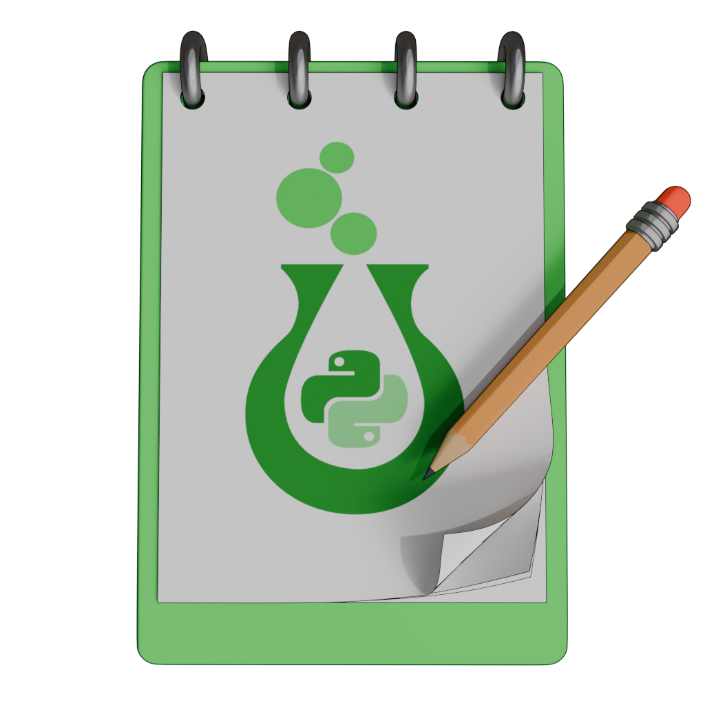
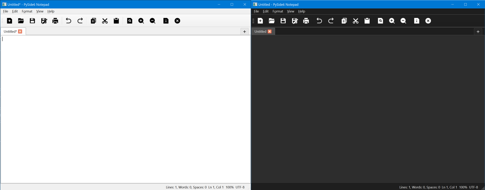
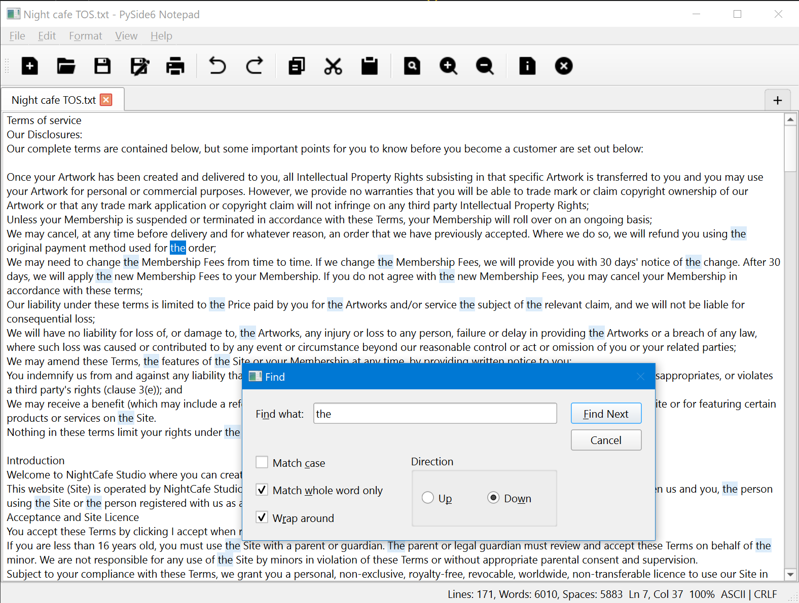
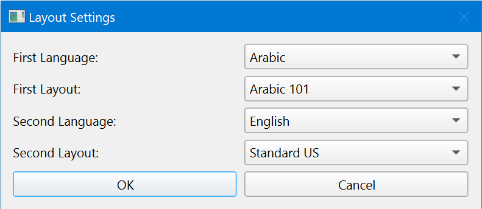
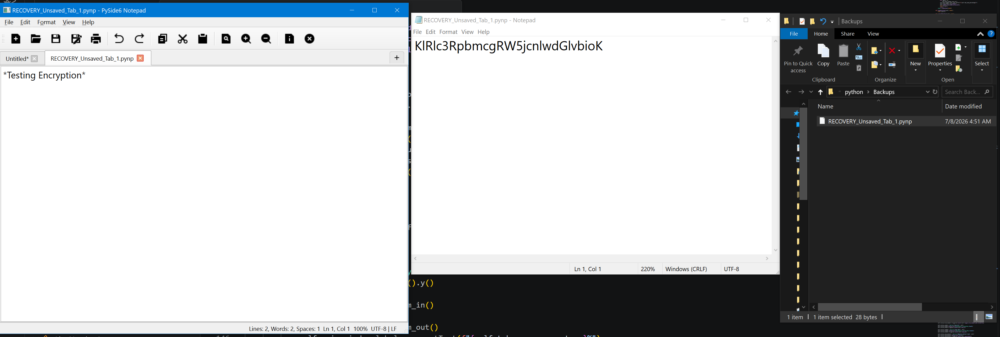

# PySide6 Notepad with Dynamic Layout Inversion

<p align="center">
  
</p>

A professional, feature-rich desktop text editor built with Python and PySide6 (Qt for Python). This application bridges the gap between creative text production and structured source-code editing, featuring a modular architecture, background session auto-recovery, and an advanced trilateral keyboard layout engine.

---

## 📸 Application Interface

### 🖥️ Main Workspace UI
*The clean, tabbed main editor displaying native Python syntax highlighting, full toolbar controls, dynamic line numbers, and active status tracking bar indicators.*


---

## 🚀 Key Features

### 1. Advanced Desktop Text Engine
* **Dynamic Line Numbering:** Fully synchronized custom line-number viewport integrated with the scrollbars, preventing layout clipping (Disabled by default).
* **Smart Tab Reuse:** Blender-style asset management that reuses initial workspace layouts to eliminate unmapped file clutter.
* **Contextual Zoom Engine:** Precise viewport zoom scaling strictly bounded between 10% and 500% via mouse-wheel controls or default OS zoom-in and zoom-out controls.
* **Paste as Plain Text:** Context-aware clipboard manipulation (`Cmd/Ctrl + Shift + V`) that strips rogue rich text formatting before viewport insertion.
* **Native CLI File Boot:** Supports direct initialization via command-line arguments (CLI execution). Passing a valid file path during startup (e.g., `python main.py resume.txt`) instantly bypasses the auto-detects encoding, applies syntax highlighters, and boots the file straight into the live viewport.

### 2. Intelligent Layout Inversion Engine (Core Niche Feature)
* **On-the-Fly Lexical Conversion:** Corrects text typed accidentally on the wrong hardware keyboard layout (e.g., Arabic 101 to US English) instantly using `Cmd/Ctrl + Shift + K` or navigating to **Edit -> Convert Keyboard Layout** in the top menu bar. This feature is rarely implemented in mainstream text editors.
* **Extensive Language Fleet:** Fully supports trilateral and cross-layout typing conversion for **Arabic, English, Spanish, French, German, Russian, Portuguese, Hindi, and Italian**. *(Note: While all these layout dictionaries are fully implemented, currently only the Arabic to English translation mapping and vice-versa has been thoroughly QA tested)*.
* **Trilateral Layout Protection:** Prevents duplicate cross-mapping bugs by isolating active configurations during preferences assignment.
* **Composite Character Safety:** Implements a localized Private Use Area (PUA) token loop to protect composite glyphs (like the Arabic "لا") from breaking alignment.

### 3. Session Recovery Vault & Housekeeping
* **Background Auto-Backup Daemon:** A secure daemon ticking every 60 seconds to safeguard unsaved active document partitions.
* **Payload Serialization:** Safely serializes recovery file inputs on-the-fly via pure Base64 encoding to secure localized temporary assets.
* **Automated Housekeeping:** Instantly purges runtime recovery footprints from disk the exact millisecond a standard successful save operation is recorded.
* **Proactive Interception:** Dynamically detects `.pynp` backup streams on desktop Drag & Drop or file dialog requests and decodes them back into readable strings automatically.

### 4. Cross-Platform Native Look & Feel
* **Decoupled Theme Manager:** Instant propagation of theme mode transformations (Light, Dark, or native System OS triggers) across stylesheets, canvas palettes, and language highlighters.
* **Contrast-Aware Highlighter:** Scalable custom syntax highlighting for 15+ environments (Python, C++, Java, JS/TS, SQL, JSON, YAML, etc.) with automated token brightness tuning.
* **Native Linux/Windows Hooks:** Links directly to OS font settings managers natively (optimized for KDE Plasma/GNOME and modern Windows Settings URIs).

---

## 📸 Visual Highlights & Tested Features

### 🔍 Find/Replace Dual-Blue Engine & Custom Font Explorer
*The search module features a custom dual-blue selection filter highlighting the active focused term differently from secondary matches. The Windows-style Font dialog dynamically hooks into system script templates (Arabic, Cyrillic, Thai, Devanagari) for live previewing.*


### ⌨️ Dynamic Layout Converter Dialogue
*The core preference panel ensuring full conflict safety when assigning your primary and secondary hardware keymaps.*


### 🛡️ Recovery Vault Verification
*Demonstration of the background daemon safely encoding modified tab assets into temporary backup binaries, which instantly auto-decode when dragged back into the viewport.*


---

## 🛠️ Project Architecture

The codebase strictly adheres to the **Single Responsibility Principle (SRP)** by decoupling visualization routines from computational backends:
* `main.py`: The application bootstrapper.
* `mainwindow.py`: Handles parent window layouts, toolbar binding, and unified signals/slots routing.
* `ui_dialogs.py`: Houses all custom popups and the standalone static `ThemeManager`.
* `editor_utilities.py`: The processing backbone driving text encoding, I/O streams parsing, and syntax compiling.
* `keyboard_layout.py`: Hardcoded physical hardware matrix registries and inverse dictionary utilities.

---

## 👥 Credits & AI Collaboration Disclosure

This project was envisioned, architected, and driven by **Muhammad Attiya ([@mattiya3d](https://github.com/mattiya3d))**.

### Development Methodology:
As a modern approach to software engineering, this application was built using **Generative AI (Large Language Models) as an interactive development partner and Copilot**.
* **Human/Architect Role:** Conceptual design, layout mapping logic, core feature specifications, cross-platform requirements (macOS/Linux/Windows optimization), and strategic bug catching.
* **AI Copilot Role:** Writing boilerplate code, implementing specific PySide6 syntax patterns, performing structural refactoring, and optimizing safety parameters.

*Using AI as a technical collaborator allowed me to scale this prototype into a clean, functional desktop application efficiently while focusing heavily on user-experience mechanics.*

---

## 📦 Installation & Execution

1. Clone the repository:
```bash
git clone [https://github.com/mattiya3d/PySide6Notepad.git](https://github.com/mattiya3d/PySide6Notepad.git)
cd PySide6Notepad


2. Install dependencies:

Bash
pip install -r requirements.txt

3. Launch the application:

```bash
# To boot into a clean blank workspace
python main.py

# To instantly load and parse a file directly from your terminal
python main.py path/to/your/file.txt